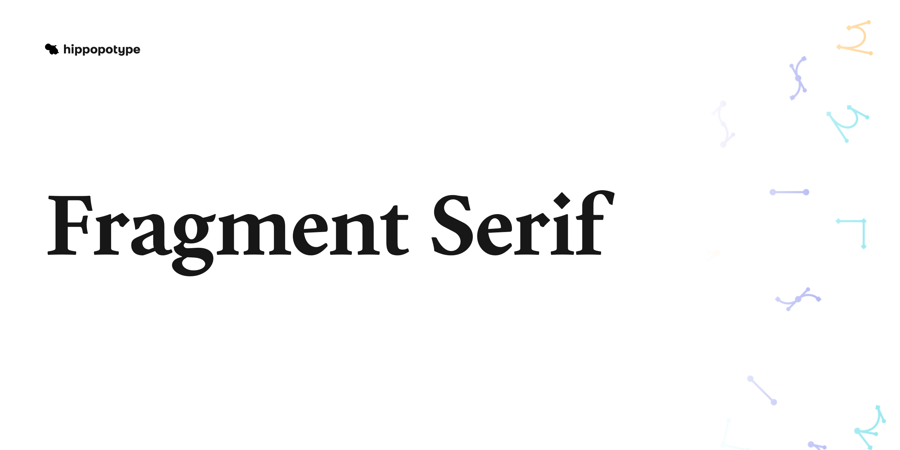
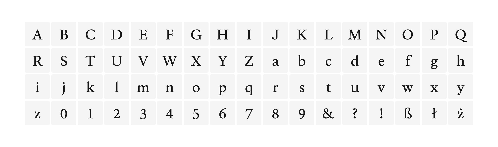
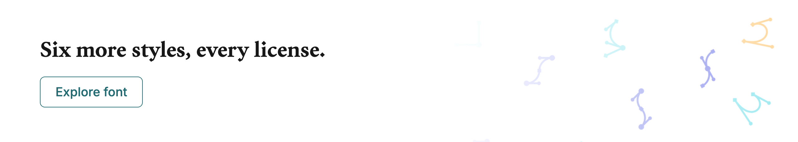

<p align="center"><picture>
  <source media="(prefers-color-scheme: dark)" srcset="images/banner-dark.png">
  
</picture></p>

<p align="center"><sub>Fragment Serif is a text-and-display serif balancing editorial sharpness with easy reading rhythm. Regular is free for Desktop and Web. Six more styles are at <a href="https://hippopotype.com/fonts/fragment-serif">hippopotype.com</a>.</sub></p>

<p align="center"><sub><a href="https://github.com/hippopotype/fragment-serif/releases/latest">Download</a> · <a href="#specimen">Specimen</a> · <a href="LICENSE.md">License</a> · <a href="https://hippopotype.com/fonts/fragment-serif">All styles</a></sub></p>

## Specimen

<picture>
  <source media="(prefers-color-scheme: dark)" srcset="images/glyphs-dark.png">
  
</picture>

<picture>
  <source media="(prefers-color-scheme: dark)" srcset="images/showcase-1-dark.png">
  
</picture>

<picture>
  <source media="(prefers-color-scheme: dark)" srcset="images/showcase-2-dark.png">
  
</picture>

<picture>
  <source media="(prefers-color-scheme: dark)" srcset="images/showcase-3-dark.png">
  
</picture>

<picture>
  <source media="(prefers-color-scheme: dark)" srcset="images/showcase-4-dark.png">
  
</picture>

## Download

Get the zip from [Releases](https://github.com/hippopotype/fragment-serif/releases/latest), or take the files from `fonts/`:

- `fonts/otf/` for Desktop
- `fonts/woff2/` for Web

## Use it on the web

Copy `fonts/woff2/` into your site, then:

```css
@font-face {
  font-family: "Fragment Serif";
  src: url("fonts/woff2/FragmentSerif-Regular.woff2") format("woff2");
  font-weight: 400;
  font-display: swap;
}
```

## License

Free to use, not open source: Desktop and Web at the first tier are free, while higher tiers and App, Advertising, Broadcasting and OEM use are licensed at [hippopotype.com](https://hippopotype.com/fonts/fragment-serif), and the files may not be modified or passed on. The full terms are in [LICENSE.md](LICENSE.md), the same terms as [hippopotype.com/licensing](https://hippopotype.com/licensing).

The font files don't take pull requests, but issues about them are welcome.

<p align="center"><a href="https://hippopotype.com/fonts/fragment-serif"><picture>
  <source media="(prefers-color-scheme: dark)" srcset="images/more-dark.png">
  
</picture></a></p>

<p align="center"><sub>hippopotype · v1.210</sub></p>
